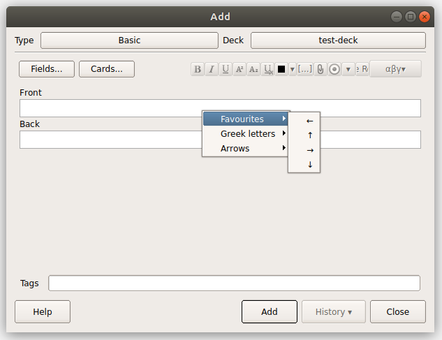

# Anki Symbols

I wanted a quick way to insert symbols in Anki without needing to use a massive formatting pack or writing the whole card in Latex.

The menu can also be triggered by Ctrl+S.

The Favourites sub-menu can be changed in the source file, just add your desired symbols' decimal unicode id to the list.

***

Lots of inspiration from https://github.com/paladini/anki-greek-letters