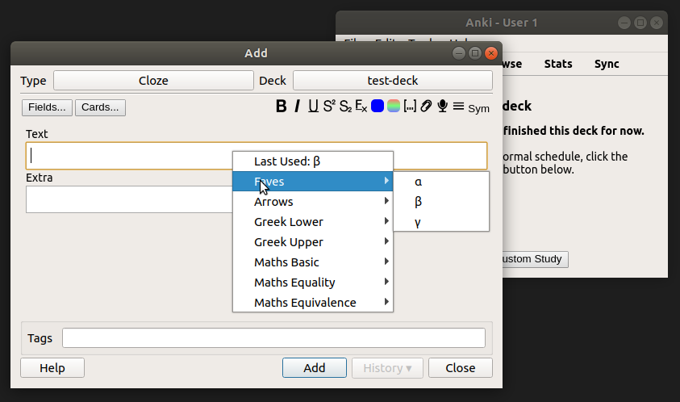
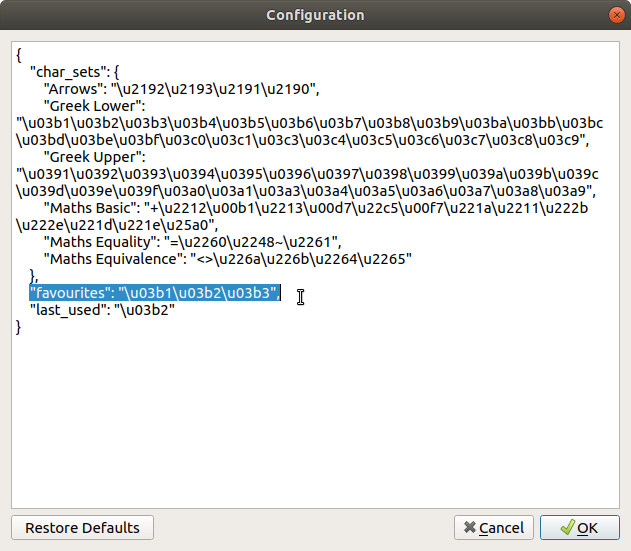

# Anki Symbols

Anki Symbols, now with added Symbols!

The menu can also be triggered by Ctrl+S.

Revamped the whole addon to tackle Anki 2.1, as well as added more symbols and customisation. Now includes "Last Used" symbol to aid in the menu spam.

Favourties menu can be edited in the Anki Config via Tools > Add-Ons > Config

Just add the symbols you want to the "favvourites" key and they will appear. Whole Char Sets can be added in a similar fashion, just keep to the current Schema.

Feel free to suggest any additional symbols to the current set, and we can share them with everyone!

Installation to Anki with code - *1461102936*

***

Lots of inspiration from https://github.com/paladini/anki-greek-letters
